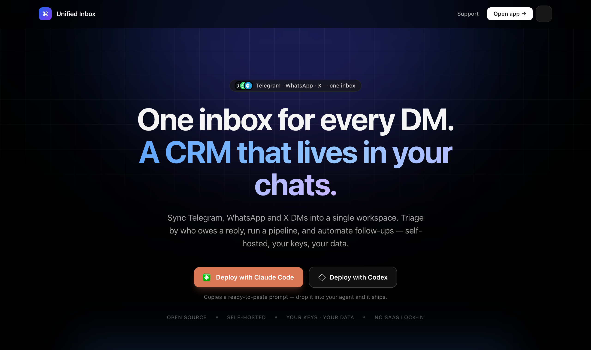
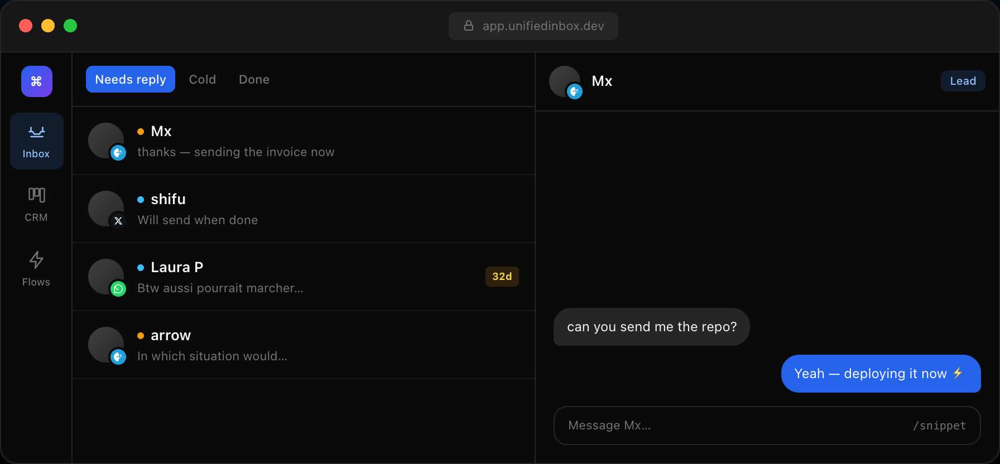
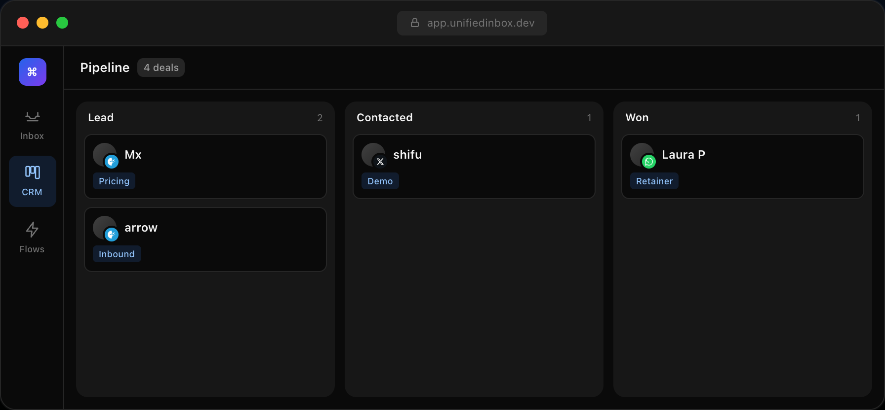
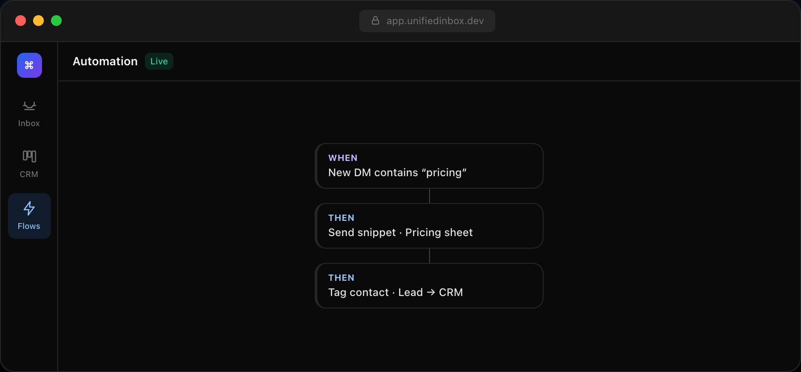

<div align="center">

# 2 Many DM's

### One inbox for every DM — with a CRM built in.

Sync your **Telegram**, **WhatsApp** and **X** DMs into a single, self-hosted workspace.
Triage by who owes a reply, run a pipeline, and automate follow-ups.

<br/>



<br/>


</div>

---

## Why

Your leads live across Telegram, WhatsApp and X — and they all drop into separate apps with separate
notification badges. **2 Many DM's** pulls every DM into one inbox and adds the layer those apps are
missing: a CRM. It knows whose turn it is to reply, surfaces conversations going cold, lets you drag
contacts through a deal pipeline, and fires automations off keywords — all running on **your** box,
with **your** keys, no SaaS in the middle.

## Features

### 🗂️ Turn-based triage inbox
Every chat is sorted by **whose turn it is** — *Needs reply* vs *Cold* — so you never drop a lead.
Snooze, mark done, and a "going cold" badge flags anyone you've left waiting.



### 📊 CRM pipeline board
Drag contacts through **Lead → Contacted → Won**. A real deal pipeline, or group by tag.



### ⚡ Node automations
Visual flows: a **trigger** (keyword, no-reply, new chat, broadcast) chained to **actions** —
send a snippet, tag, or set status. Dry-run before you arm it.



### …and the rest
- **⌘K command search** — fuzzy-search every chat, multi-select, bulk-add to folders.
- **Contacts & relations** — company, email, phone, notes, tags, and links between people and chats.
- **Snippets & composer** — saved replies with ⌘-key shortcuts, a `/` picker, emoji, and platform-aware attachments.
- **Two-way read sync** — read on your phone and the badge clears here; open it here and it marks read on the platform.
- **Encrypted sessions** — login sessions are encrypted at rest (AES-256-GCM).
- **True-black dark mode** with a circular-reveal theme toggle.

## Deploy in one paste

The landing page has **"Deploy with Claude Code / Codex"** buttons that copy a ready-to-paste prompt.
Drop it into your coding agent and it clones, configures the env, and ships. The prompt is simply:

```
Clone and deploy https://github.com/AZK65/2-Many-DMs for me: npm install, copy .env.example
to .env and fill DATABASE_URL + TELEGRAM_API_ID/API_HASH + APP_ENCRYPTION_KEY (openssl rand -hex 32),
run npx prisma db push, then deploy with the included Dockerfile (Railway works great — see railway.json).
Run the sync worker (npm run sync) alongside the web server.
```

## Quick start (local)

```bash
git clone https://github.com/AZK65/2-Many-DMs.git
cd 2-Many-DMs
npm install

cp .env.example .env          # then fill in the values below
npx prisma db push            # create the SQLite schema
npm run db:seed               # optional: demo data to click around

npm run dev                   # web app  →  http://localhost:3000
npm run sync                  # in a second terminal: the channel sync worker
```

Open `http://localhost:3000` for the inbox, `/board` for the pipeline, `/automations` for flows,
and `/landing` for the marketing page.

## Connecting your channels

| Channel | How it links |
| --- | --- |
| **Telegram** | `npm run tg:login` — one-time phone-code login (uses your own `TELEGRAM_API_ID`/`API_HASH` from [my.telegram.org](https://my.telegram.org)). |
| **WhatsApp** | Set `WHATSAPP_ENABLED=1`, run the worker, and scan the QR with **WhatsApp → Linked Devices**. The session persists in `.wwebjs_auth`. |
| **X / Twitter** | `npm run x:login`, **or** paste your `auth_token` + `ct0` cookies into `.env`, **or** use the bundled [Chrome extension](extension/) to hand off your session with a pairing code. |

> **Heads-up on X:** don't run the X browser through a datacenter proxy. Deploy on your own machine or
> use a residential/5G proxy, or you risk an account ban.

## Environment

All config lives in `.env` (see [`.env.example`](.env.example)). The essentials:

| Variable | What it's for |
| --- | --- |
| `DATABASE_URL` | SQLite path, e.g. `file:./dev.db` (or a mounted volume in prod). |
| `TELEGRAM_API_ID` / `TELEGRAM_API_HASH` | Your Telegram app credentials. |
| `TELEGRAM_SESSION` | Filled in by `npm run tg:login`. |
| `APP_ENCRYPTION_KEY` | 64-hex-char key to encrypt stored sessions. **Required in production.** |
| `X_AUTH_TOKEN` / `X_CT0` | X session cookies (or use `x:login` / the extension). |
| `PROXY_URL` | Optional sticky residential proxy for the WhatsApp/X browsers. |

## Deploy (Railway / Docker)

The repo ships a `Dockerfile` (with system Chromium for the WhatsApp/X browsers), a `railway.json`,
and a `start.js` that runs `prisma db push` on boot. One container runs both the web server and the
sync worker. Mount a volume at `/data` and point `DATABASE_URL` / `DATA_DIR` at it so your DB and
login sessions survive restarts.

## Architecture

```
Next.js app (App Router)  ──┐
                            ├── Prisma / SQLite  (conversations, contacts, automations)
Sync worker (tsx)         ──┘
  ├── Telegram  (GramJS / MTProto)
  ├── WhatsApp  (whatsapp-web.js + Puppeteer)
  └── X         (Puppeteer + stealth + fingerprint injection)
```

## Security & privacy

- **Your data never leaves your server.** No third-party SaaS, no per-seat pricing.
- Login sessions are **encrypted at rest** (AES-256-GCM via `APP_ENCRYPTION_KEY`).
- `.env`, the SQLite DB, and all session folders (`.wwebjs_auth`, `.x_auth`, …) are git-ignored and
  never committed.

## Custom integrations & support

Need another channel, a bespoke automation, or hands-on setup? Custom work and support are available
as a **paid** option — DM the developer on Telegram (link in the app's support bubble).

## License

[MIT](LICENSE).
